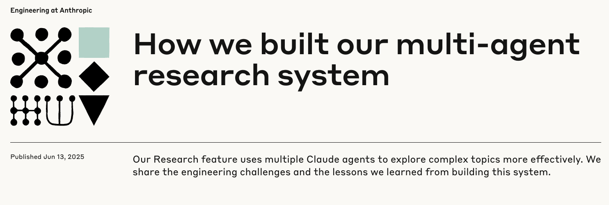

# Multi-Agent AI Applications

For most problems, deterministic AI workflows are often the best solution. They're simpler to build, easier to debug and optimize, and much more reliable. Fewer business problems are better suited for agents, and fewer still require multi-agent. There is a large amount of tech debt involved in building and maintaining agents and multi-agent systems, and often unclear or hard to measure ROI. Gartner predicts that "over 40% of agentic AI projects will be scrapped by 2027 due to escalating costs and unclear business value" (see [Gartner Report](https://www.reuters.com/business/over-40-agentic-ai-projects-will-be-scrapped-by-2027-gartner-says-2025-06-25/?utm_source=chatgpt.com)). This aligns with Anthropic's internal findings that "agents typically use about 4x more tokens than chat interactions, and multi-agent systems use about 15x more tokens than chats" ([Anthropic's Multi-Agent Research System](https://www.anthropic.com/engineering/multi-agent-research-system)).

Therefore, you should only use them if you have clearly established that a simpler workflow will not work. Despite the technical challenges, there definitely are some problems that are better suited for agents and multi-agent.

[Read the full blog...](https://www.anthropic.com/engineering/multi-agent-research-system)

A fantastic example of a production multi-agent system is Anthropic's [Multi-Agent Research System](https://www.anthropic.com/engineering/multi-agent-research-system). This is a must-read if you want to learn more about building effective multi-agent systems.

Agents and multi-agent systems can be extremely powerful and valuable if applied to the right problems. Many companies are in the process of building agents and/or have plans to build them in the near future (see [State of AI Agents](https://www.langchain.com/stateofaiagents)) with the top use cases being research and summarization. So 2025 has definitely been the year of agents and we should expect 2026 to show increased adoption of multi-agent systems.

## Why Multi-Agent?

1. Context management
    - Separate context for each agent - system prompt, tools, memory, etc. This keeps agents focused on their own tasks without getting distracted by irrelevant context and can greatly improve performance and reliability.
2. Massively scale token usage -> scale performance
    - Each agent has its own context window and the number of agents in the system therefore becomes a multiplier for the amount of work that can be done in a single context window. By cleanly managing context and having a separate context window for each agent/task, we can essentially multiply the amount of reasoning tokens of the overall system which leads to better performance.
3. Modularize concerns and optimizations
    - Each agent can be optimized independently for its specific task. This allows us to use the right model and tools for each task and also allows us to update and improve each agent independently.
4. Efficiency
    - Through parallelization and task decomposition, we can perform multiple tasks simultaneously, which can significantly reduce the overall latency of the workflow. Parallelization also allows "breadth" where we can explore multiple angles and perspectives simultaneously, which can lead to more creative and insightful solutions.

## Multi-Agent Patterns

Langgraph outlines 4 main [multi-agent patterns](https://langchain-ai.github.io/langgraph/concepts/multi_agent/):

1. Supervisor
    
2. Network
3. Hierarchical
4. Custom
