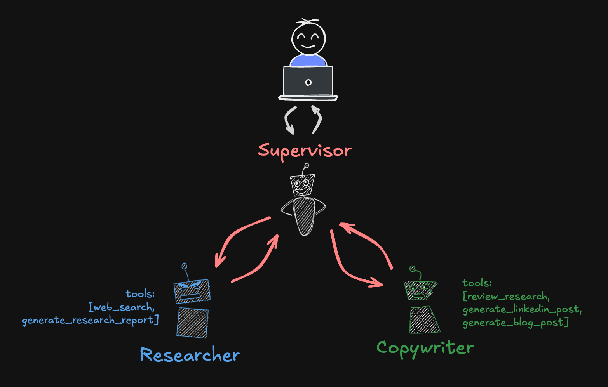

# Multi-Agent Supervisor

This multi-agent example uses a supervisor agent to coordinate the work of multiple sub-agents. The supervisor agent is responsible for interacting with the user and managing the workflow. The sub-agents perform specific tasks delegated by the supervisor, but never interact with the user directly.

In this specific application, the supervisor agent coordinates the work of a researcher agent and a copywriter agent. The researcher agent performs research tasks and the copywriter agent generates content based on the research reports. The supervisor agent manages the workflow, including breaking down complex tasks into multiple research tasks, calling the researcher agent multiple times, waiting for all research to complete, and then calling the copywriter agent once with clear instructions to synthesize all research reports.

The supervisor pattern is well suited for use cases where there are clear handoffs between different agents with specialized capabilities. The supervisor can be thought of as a project manager or program coordinator that oversees the work of multiple agents and ensures that the overall goal is achieved. It's also useful when you have sub-agent workflows that can be ran independently and in parallel.
